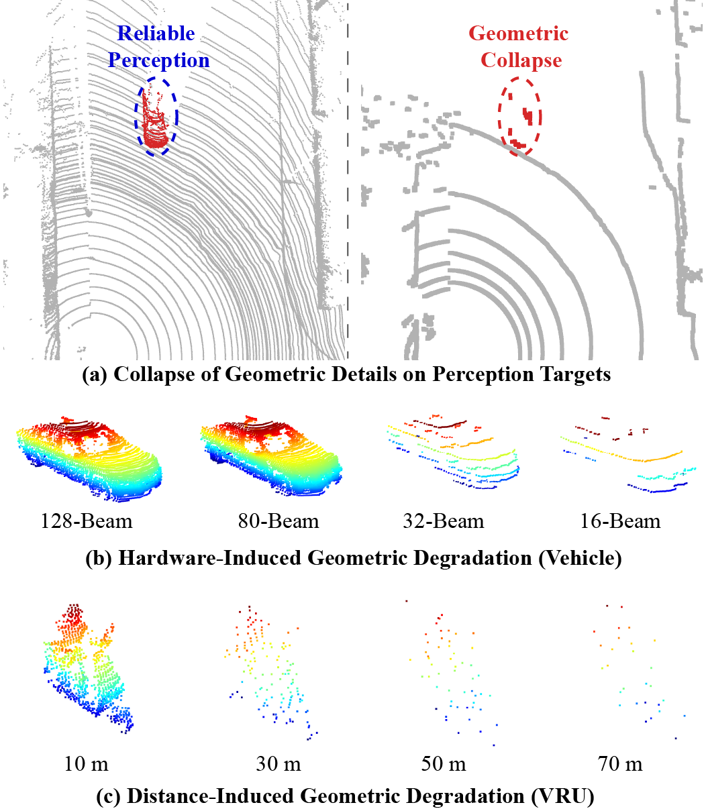
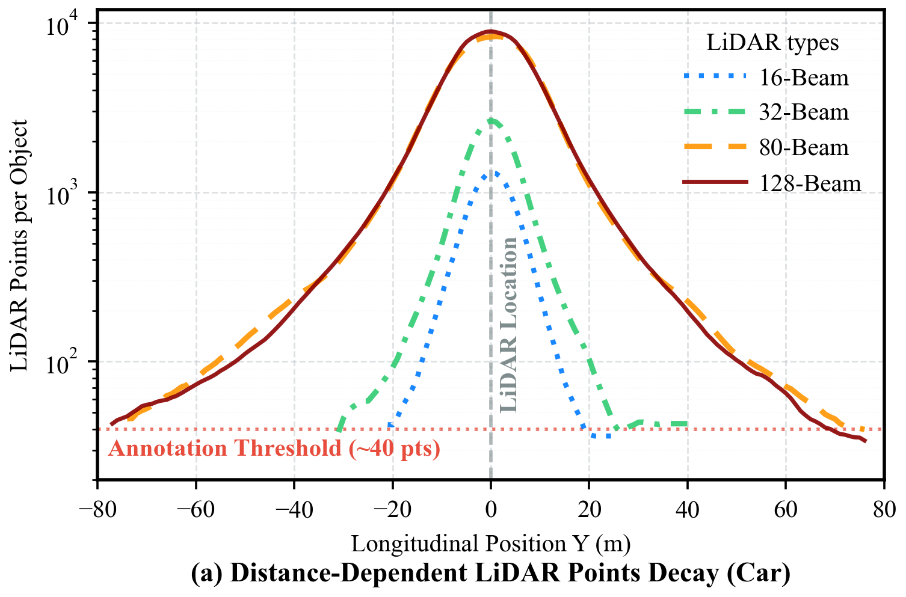
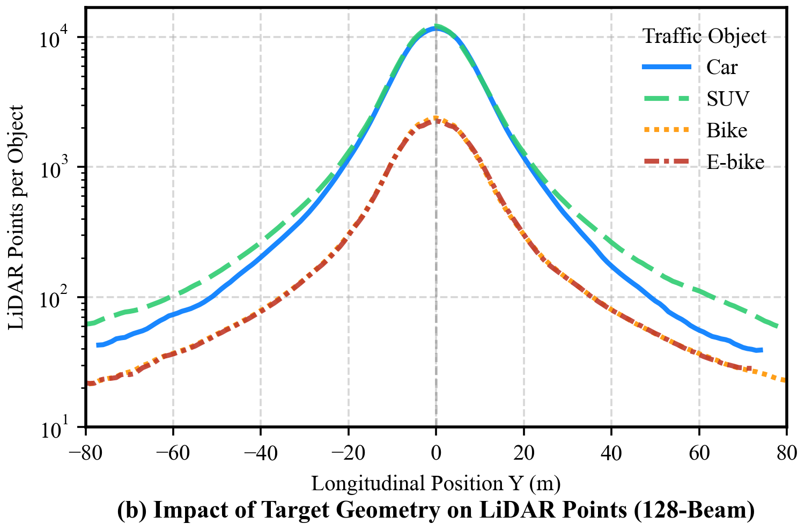
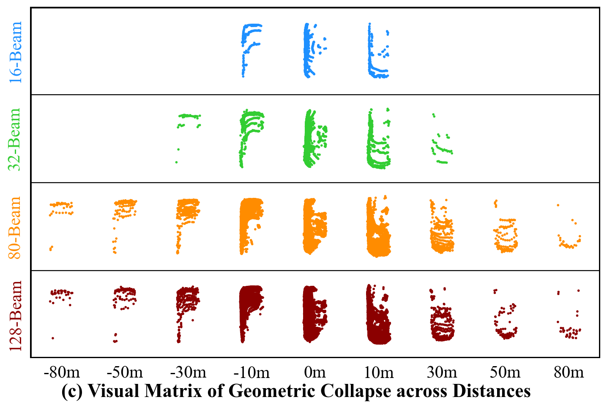
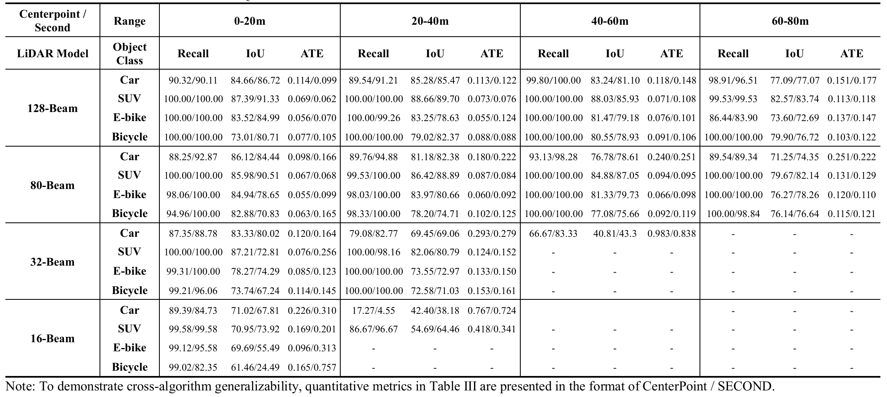

# MR-LiDAR: A Multi-Resolution Benchmark for Roadside Perception Diagnostics


---

## 📌 Overview

**MR-LiDAR** is a controlled multi-resolution roadside LiDAR benchmark designed specifically for **hardware perception diagnostics**. By simultaneously deploying 16-, 32-, 80-, and 128-beam LiDARs within identical geometric scenarios, it enables direct cross-tier comparisons that are impossible with single-sensor datasets.

<div align="center">

<br>
<em>Figure: Geometric Collapse and Degradation in Roadside Perception across LiDAR tiers and distances.</em>
</div>


---

## 🔗 Comparison with Existing Datasets

| Dataset | Year | Viewpoint | LiDAR Config | Dynamic Targets | Hardware Hierarchy | Focus |
|---|---|---|---|---|---|---|
| KITTI | 2012 | Ego-Vehicle | 1 × 64-beam | ✅ | ❌ | Algorithm Benchmarking |
| Waymo | 2019 | Ego-Vehicle | 1 × 64-beam | ✅ | ❌ | Large-scale Perception |
| nuScenes | 2019 | Ego-Vehicle | 1 × 32-beam | ✅ | ❌ | Multimodal Fusion |
| LIBRE | 2020 | Ego-Vehicle | 10 Types | ❌ (Static) | ✅ | Sensor Comparison |
| DAIR-V2X-I | 2022 | Roadside | 1 × 300-beam | ✅ | ❌ | Cooperative Perception |
| TUMTraf | 2023 | Roadside | 1 × 64-beam | ✅ | ❌ | Traffic Flow Analysis |
| **MR-LiDAR (Ours)** | **2026** | **Roadside** | **16/32/80/128** | ✅ | ✅ | **Hardware Diagnostics** |

---
## 🗂️ Dataset Statistics

| Property | Value |
|---|---|
| Total LiDAR Frames | **10,497** |
| Controlled Sequences | **32** |
| Sequence Duration | ~60 seconds each |
| LiDAR Configurations | 16 / 32 / 80 / 128 beams |
| Object Classes | Car, SUV, E-bike, Bicycle |
| Illumination | Daytime (64.3%) / Nighttime (35.7%) |
| Occlusion Frames | 2,612 (Car-Occ subset) |

### Frame Distribution by LiDAR

| LiDAR | Beams | Valid Frames |
|---|---|---|
| RS-Ruby-Plus | 128 | 3,770 |
| RS-Ruby-80V | 80 | 3,964 |
| RS-Helios-1615 | 32 | 1,618 |
| RS-LiDAR-16 | 16 | 1,145 |

### Object Class Distribution

| Class | Frames | Proportion |
|---|---|---|
| Car | 2,842 | 27.1% |
| Car-Occ | 2,612 | 24.9% |
| SUV | 2,398 | 22.8% |
| E-bike | 1,465 | 14.0% |
| Bicycle | 1,180 | 11.2% |

---

## 🔬 Benchmark Design

### Experimental Setup

Data collection was performed on a **200-meter straight road segment** at Southwest Jiaotong University. Targets traversed continuously from far-field (>80m) to near-field at ~10 km/h, ensuring high-density per-meter sampling. All four LiDARs were sequentially mounted on a standardized 1.5-meter bracket to guarantee identical viewpoint alignment.

**Illumination Conditions:**
- ☀️ Sunny Daylight: 28,256 Lux
- 🌙 Low-light Nighttime: 81 Lux

<div align="center">

<br>
<em>Figure: Controlled Experimental Setup and LiDAR Configuration.</em>
</div>


### LiDAR Specifications

| | RS-LiDAR-16 | RS-Helios-1615 | RS-Ruby-80V | RS-Ruby-Plus |
|---|---|---|---|---|
| **Beams** | 16 | 32 | 80 | 128 |
| **Horizontal FOV** | 360° | 360° | 360° | 360° |
| **Horizontal Resolution** | 0.1°–0.4° | 0.2°–0.4° | 0.1°–0.4° | 0.1°–0.4° |
| **Vertical FOV** | ±15° | -16°~+15° | -25°~+0.2° | -25°~+15° |
| **Vertical Resolution** | 2° | 1° | Up to 0.1° | Up to 0.1° |

### Annotation Pipeline

1. **Model-assisted initialization** — Pre-trained 3D detection generates coarse bounding box proposals via SUSTechPOINTS.
2. **Manufacturer-standardized dimensions** — Box dimensions (l, w, h) are fixed to official vehicle specs, eliminating human estimation variance.
3. **Human-refined alignment** — Annotators fine-tune center coordinates (x, y, z) and yaw angle.
4. **Drone BEV reference** — A Mavic 3 Pro drone provides bird's-eye-view video for ground truth validation during occlusion phases.

---

## 📁 Data Structure
```
MR-LiDAR_Benchmark/
├── 20250409-Day/
│   ├── 128-Beam/
│   │   ├── Car/
│   │   │   └── Seq_20250489.../
│   │   │       ├── lidar/
│   │   │       │   ├── 0001.pcd
│   │   │       │   └── ...
│   │   │       ├── label/
│   │   │       │   ├── 0001.json
│   │   │       │   └── ...
│   │   │       ├── vehicle_pcd/
│   │   │       │   ├── 0001.pcd
│   │   │       │   └── ...
│   │   │       └── video/
│   │   │           └── drone_view.mp4
│   │   ├── Car-Occlusion/
│   │   ├── SUV/
│   │   ├── E-bike/
│   │   └── Bicycle/
│   ├── 80-Beam/
│   ├── 32-Beam/
│   └── 16-Beam/
└── 20250324-Night/
    └── ...
```

Each sequence contains:
- **`lidar/`** — Full-scene LiDAR point clouds (`.pcd`)
- **`label/`** — 3D bounding box annotations (`.json`)
- **`vehicle_pcd/`** — Pre-cropped target point clouds for density analysis
- **`video/`** — Synchronized drone BEV video for occlusion ground truth

---

## 📊 Benchmark Results

<div align="center">



<br>
<em>Figure: Quantitative Evaluation of LiDAR Perception Performance across Distances and Object Classes.</em>
</div>


### Detection Performance Summary 
<div align="center">

<br>
<em>Figure: Quantitative LiDAR Diagnostics Benchmark Results.</em>
</div>


---


## 📜 Citation

If you find MR-LiDAR useful in your research, please cite:
```bibtex
@article{mrlidar2026,
  title     = {MR-LiDAR: A Multi-Resolution Benchmark for Roadside Perception Diagnostics},
  author    = {Author, First A. and Author, Second B. and Author, Third C.},
  journal   = {IEEE },
  year      = {2026},
}
```

---

## 🙏 Acknowledgements

This work was supported in part by the National Natural Science Foundation of China under Grant No. 52572362 and 52172395.

Annotation was performed using the [SUSTechPOINTS](https://github.com/naurril/SUSTechPOINTS) platform.
Detection baselines were implemented with [OpenPCDet](https://github.com/open-mmlab/OpenPCDet).

---

## 📄 License

This dataset is released under the [CC BY-NC 4.0](https://creativecommons.org/licenses/by-nc/4.0/) license.
Free for academic and non-commercial use.

---

<div align="center">
<sub>MR-LiDAR · Southwest Jiaotong University · 2026</sub>
</div>
